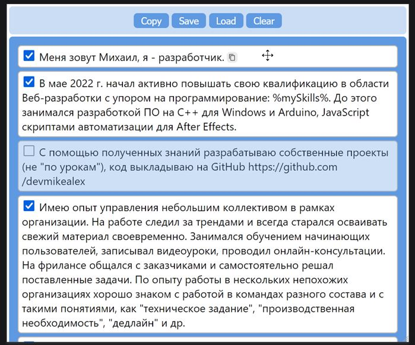

# My Responcer 📋 резюме-конструктор

Мой проект для изучения функций **drag-and-drop** в JavaScript / HTML.

## Технологии проекта

- TypeScript
- HTML
- CSS / SASS

---

На страницу из файла **data.txt** выводятся блоки текста для компоновки, которые можно перемешивать между собой и перемещать по контейнерам. На GitHub чтение происходит из упрощенного файла **data-demo.txt** без особо чувствительной личной информации.

## Интерфейс

Так же имеется два глобальных контейнера: синий и оранжевый. При нажатии кнопки копирования **Copy** содержимое синего контейнера копируется в буфер обмена. В дополнение у каждого блока есть собственный *чекбокс* для отключения и кнопка копирования содержимого в буфер обмена.

Кнопки **Save, Load, Clear** соответственно сохраняют, загружают и очищают состояния блоков (положение, включено/выключено) в локальном хранилище браузера **localStorage**.